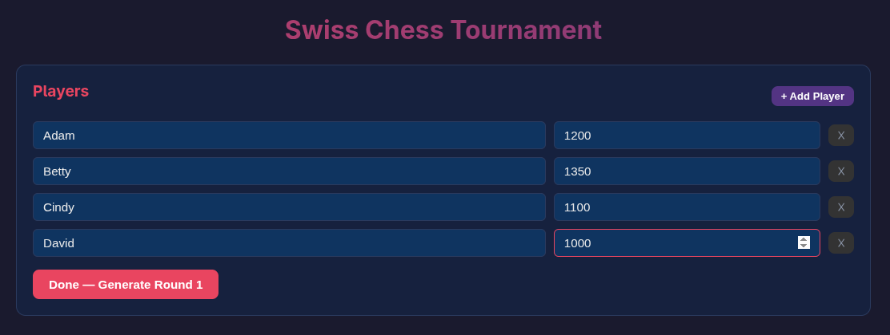
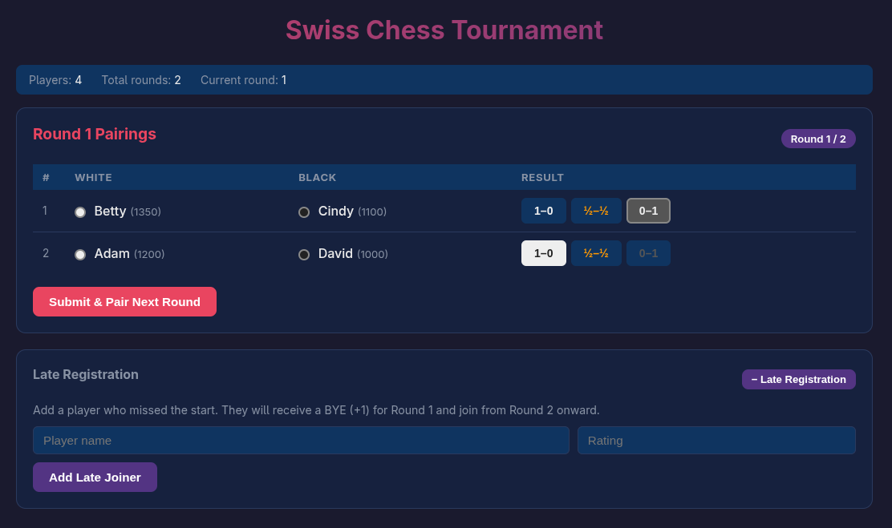

# swiss64
Swiss Tournament Manager

# What this software is

This app runs in a web browser (locally) and allows you to run a Swiss Tournament. It is specifically designed for Chess as it uses the variant of the Swiss tournament called "Dutch system" which is the official system approved by FIDE. 

The goal of the app is very simple: add players (initial setup), then generate pairings for the round according to the rules of a Swiss tournament, allow entry of results, repeat (until the recommended number of rounds has been completed). Allowed pairings are such that: paired players have not yet played together in this tournament and no player plays the same colour more than twice in a row. Another principle to be followed as much as possible - players with a similar score should be paired.

The app is a stand alone HTML page (with a JavaScript module in a separate file). You don't need to host it anywhere. Just open the `index.html` file in any browser that supports JavaScript (pretty much any modern browser).

# How to use this app

Upon opening you will be asked to enter the players for the tournament. Add them all with their names and ratings. You can add more by clicking the `+` button.

Once finished you can click the red button to start the tournament. You can now click on the result for each game. Once all results have been entered, you can generate the pairings for the next round. Yes, it is that simple! 

During the first round only you can add late joiners. They will receive a BYE (half point without playing) for the first round. 
